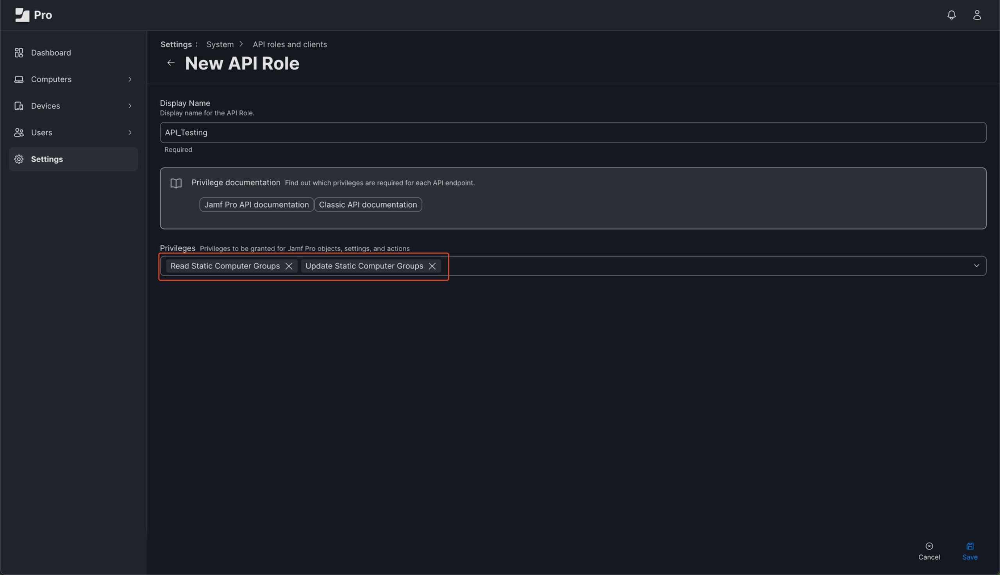
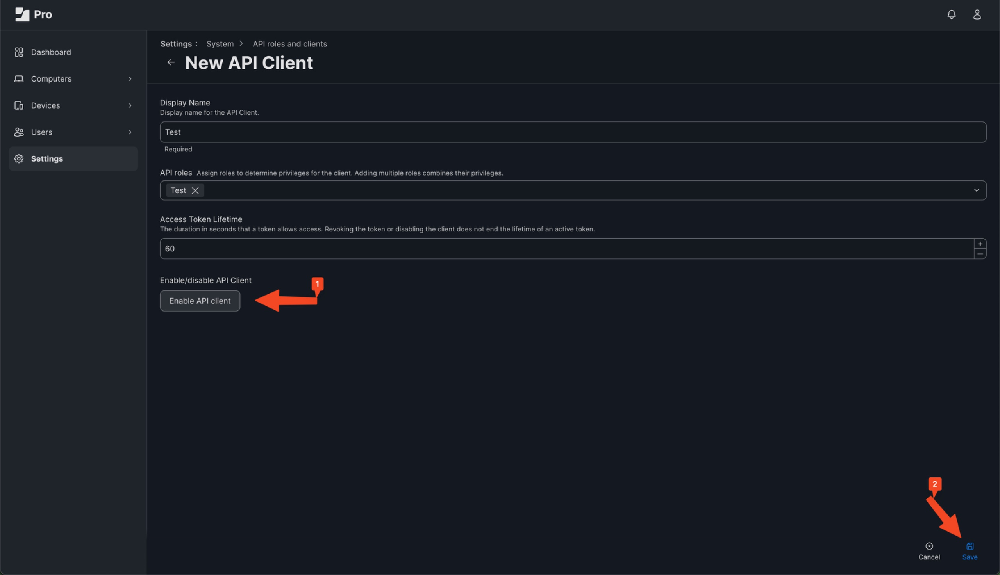
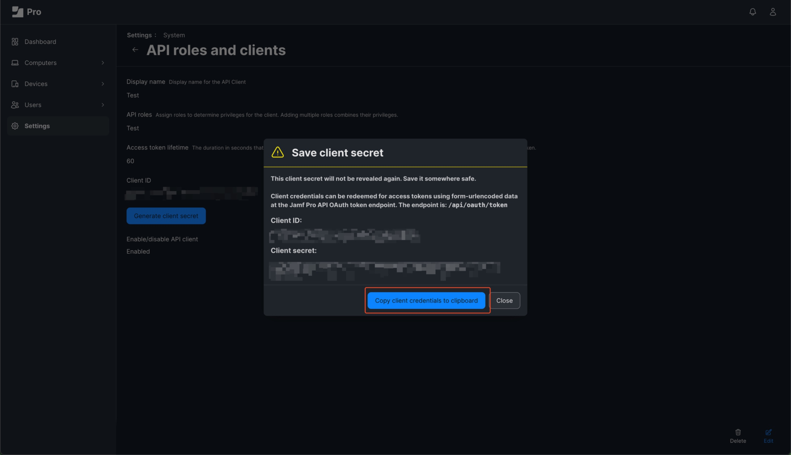

+++
title = 'Automate Jamf Device Management: Python Script for Bulk Static Group Assignment'
date = 2024-07-19T06:46:16+05:30
author = ["Sahil Poonia", "Tanuj"]
draft = false
tags = ["Automation", "Jamf"]
description = ''
+++

Jamf administrators often face the tedious task of manually adding hundreds of devices to static groups. While Jamf excels in many areas of Apple device management, bulk assignment to static groups from CSVs is still unavailable as of the time of writing this blog. Here I introduce a baseline Python script that makes use of the Jamf API to provide this feature of bulk assignment using CSVs, saving time and unnecessary headache for IT teams managing large device fleets.

We'll use Python to interact with the Jamf Pro API, allowing us to programmatically add multiple devices to a static group from a CSV file in one go. This script will significantly reduce the time and effort required for bulk device management.

**Note:** This script is a starting point and does not handle all the possible errors. It can be customized to suit your organization's needs. It is recommended to test the script in a development environment before running it in production.

## Prerequisites

- Python 3.x installed on your machine
- `requests`, `pandas`, and `python-dotenv` library installed. You can install it using the following command:

  ```bash
  python3 -m pip install requests pandas python-dotenv
  ```

  It is recommended to use a virtual environment to install the required libraries.
- Make sure you have the permission from your organization to access the Jamf API and to use this script.

## API Roles and Clients

Before we can start with the script, we need to create a new API Role and API Client in Jamf Pro. This client will provide the necessary credentials to authenticate our script with the Jamf API.

### Create an API Role

API Roles define the permissions that an API Client has when interacting with the Jamf API.

1. Log in to your Jamf Pro web interface.
2. Go to `Settings` > `System Settings` > `API roles and clients`.
3. Under the `API Roles` tab, click on the `New` button to create a new API Role.
4. Enter a name for the API Role (e.g., `Bulk Group Assignment`).
5. Under the `Privileges` tab, select the following permissions:
   - Read Static Computer Groups
   - Update Static Computer Groups
6. Click on the `Save` button to save the API Role.



### Create an API Client

API Clients are used to authenticate with the Jamf API and have specific permissions based on the API Role assigned to them.

1. Go to `Settings` > `System Settings` > `API roles and clients`.
2. Under the `API Clients` tab, click on the `New` button to create a new API Client.
3. Enter a name for the API Client (e.g., `Bulk Group Assignment Client`).
4. Select the API Role created earlier (`Bulk Group Assignment`).
5. Click on the `Save` button to save the API Client.



### Generate a Client Secret

After creating the API Client, you need to generate a client secret that will be used to authenticate with the Jamf API.

1. Click on the API Client you created earlier (`Bulk Group Assignment Client`).
2. Click on the `Generate` button next to the `Client Secret` field.
3. Copy the generated client secret and save it in a secure location.



## File structure

```
./
|
|-- jamf_bulk_group_assign.py
|-- .env.config
|-- .env.secret
|-- .gitignore
```

We will be using the `dotenv` library to read the environment variables from the `.env` files. The `.env.config` file will contain the configuration variables such as the Jamf URL and API Paths. The `.env.secret` file will contain the sensitive information such as the API Client ID and Secret.

The `.env.config` file will look like this:

```bash
ROOT_URL="https://yourserver.jamfcloud.com"
API_ACCESS_TOKEN_PATH="api/oauth/token"
API_COMPUTER_GROUP_PATH="JSSResource/computergroups/id"
```

The `.env.secret` file will look like this:

```bash
CLIENT_ID="put_your_client_id_here"
CLIENT_SECRET="put_your_client_secret_here"
```

Ensure the sensitive configuration file is not tracked in version control. Add the following line to your `.gitignore` file:

```bash
.env.secret
```

You can always use dedicated secrets management tools like HashiCorp Vault or AWS Secrets Manager but for the sake of simplicity, we are using `.env` files.

## The Script

We will go through the script step by step to understand how it works. If you are already familiar with Python and only need the script, you can find it at the end of this blog.

The script reads computer names from a CSV file, constructs an XML payload, and sends a PUT request to the Jamf API to update the computer group.

1. Import the required libraries:

  ```python
  import requests, json, sys, pandas
  from dotenv import dotenv_values
  ```

  `requests` is used to make HTTP requests to the Jamf API, `json` is used to parse JSON responses, `sys` is used to handle system-specific parameters and functions, `pandas` is used to read the CSV file, and `dotenv` is used to read the environment variables from a `.env` file.

2. Load the configuration and secret files:

  ```python
  GROUP_ID = sys.argv[1] if len(sys.argv) > 1 else ""    # ID of the Jamf Pro computer group to update
  GROUP_NAME = sys.argv[2] if len(sys.argv) > 2 else ""  # Name of the Jamf Pro computer group
  CSV_PATH = sys.argv[3] if len(sys.argv) > 3 else ""    # Path to the CSV file containing computer names
  ACCESS_TOKEN = "" # Access token for authenticating with the Jamf Pro API (will be obtained later)

  config = {
      **dotenv_values(".env.shared"),  # load config variables
      **dotenv_values(".env.secret"),  # load sensitive variables
  }
  ```

3. Input Validation:

  ```python
  if not (CSV_PATH and GROUP_ID and GROUP_NAME):
      print("Error: Please provide all required arguments.")
      print("Usage: python main.py <GROUP_ID> <GROUP_NAME> <CSV_PATH>")
      sys.exit(1)  # Exit with error code
  ```

  The command line arguments are validated to ensure that the required arguments are provided. The script expects the Group ID, Group Name, and the path to the CSV file as command line arguments.

  ```bash
  python main.py <GROUP_ID> <GROUP_NAME> <CSV_PATH>
  ```

4. Authenticate with the Jamf API and extract the bearer access token:

  ```python
  url = f"{config["ROOT_URL"]}/{config["API_ACCESS_TOKEN_PATH"]}"  # Jamf Pro token endpoint
  headers = {'Content-Type': 'application/x-www-form-urlencoded'}  # Required content type for the request
  data = {
      'client_id': config["CLIENT_ID"],
      'grant_type': 'client_credentials',
      'client_secret': config["CLIENT_SECRET"]
  }

  response = requests.post(url, headers=headers, data=data)  # Make the token request

  ACCESS_TOKEN = json.loads(response.content.decode('utf-8'))["access_token"]
  ```

  The script authenticates with the Jamf API using the client ID and secret provided in the `.env.secret` file. It then extracts the access token from the response.

5. Read the CSV file:

  ```python
  csv_df = pandas.read_csv(CSV_PATH)
  computer_names = csv_df['Computer Name'].unique()  # Get unique computer names
  ```

  The script reads the CSV file using the `pandas` library and extracts the unique computer names from the file. If the column name in your CSV file is different, you can change it accordingly. In this example, the column name is `Computer Name`.

6. Construct the XML Payload:

  ```python
  xml_header = '<?xml version="1.0" encoding="UTF-8" standalone="no"?>'
  api_data = f"""
  <computer_group>
      <id>{GROUP_ID}</id>
      <name>{GROUP_NAME}</name>
      <computer_additions>
          {"".join(f'<computer><name>{name}</name></computer>' for name in computer_names)}
      </computer_additions>
  </computer_group>
  """
  ```

  The script constructs the XML payload that will be sent to the Jamf API. It includes the Group ID, Group Name, and the list of computer names to be added to the group.

7. Send a put request to update the computer group:

  ```python
  response = requests.put(
      f"{config["ROOT_URL"]}/{config["API_COMPUTER_GROUP_PATH"]}/{GROUP_ID}",
      headers={"Content-Type": "text/xml",  # XML data
               "Authorization": f"Bearer {ACCESS_TOKEN}"},  # Add authorization header
      data=xml_header + api_data  # Combine header and XML data
  )
  ```

  The script sends a PUT request to the Jamf API to update the computer group with the new list of computers. It includes the XML payload and the access token in the headers.

## The Complete Script

```python
import requests, json, sys, pandas
from dotenv import dotenv_values


# --- Constants ---
GROUP_ID = sys.argv[1] if len(sys.argv) > 1 else ""    # ID of the Jamf Pro computer group to update
GROUP_NAME = sys.argv[2] if len(sys.argv) > 2 else ""  # Name of the Jamf Pro computer group
CSV_PATH = sys.argv[3] if len(sys.argv) > 3 else ""    # Path to the CSV file containing computer names
ACCESS_TOKEN = "" # Access token for authenticating with the Jamf Pro API (will be obtained later)

config = {
    **dotenv_values(".env.shared"),  # load config variables
    **dotenv_values(".env.secret"),  # load sensitive variables
}


# --- Input Validation ---
if not (CSV_PATH and GROUP_ID and GROUP_NAME):
    print("Error: Please provide all required arguments.")
    print("Usage: python main.py <GROUP_ID> <GROUP_NAME> <CSV_PATH>")
    sys.exit(1)  # Exit with error code


# --- Get Access Token ---
url = f"{config["ROOT_URL"]}/{config["API_ACCESS_TOKEN_PATH"]}"  # Jamf Pro token endpoint
headers = {'Content-Type': 'application/x-www-form-urlencoded'}  # Required content type for the request
data = {
    'client_id': config["CLIENT_ID"],
    'grant_type': 'client_credentials',
    'client_secret': config["CLIENT_SECRET"]
}

response = requests.post(url, headers=headers, data=data)  # Make the token request

# Parse JSON response and extract access token
ACCESS_TOKEN = json.loads(response.content.decode('utf-8'))["access_token"]


# --- Read CSV and Extract Computer Names ---
csv_df = pandas.read_csv(CSV_PATH)
computer_names = csv_df['Computer Name'].unique()  # Get unique computer names


# --- Construct XML Payload ---
xml_header = '<?xml version="1.0" encoding="UTF-8" standalone="no"?>'
api_data = f"""
<computer_group>
    <id>{GROUP_ID}</id>
    <name>{GROUP_NAME}</name>
    <computer_additions>
        {"".join(f'<computer><name>{name}</name></computer>' for name in computer_names)}
    </computer_additions>
</computer_group>
"""


# --- Update Jamf Pro Computer Group ---
response = requests.put(
    f"{config["ROOT_URL"]}/{config["API_COMPUTER_GROUP_PATH"]}/{GROUP_ID}",
    headers={"Content-Type": "text/xml",  # XML data
             "Authorization": f"Bearer {ACCESS_TOKEN}"},  # Add authorization header
    data=xml_header + api_data  # Combine header and XML data
)


# --- Handle Response ---
print(response)   # Print response status (e.g., 201 Created for success)
print(response.content)  # Print the raw response content (may be helpful for debugging)
```

## Conclusion and Thank You

Jamf Pro is a powerful tool for managing Apple devices in an enterprise environment. By using the Jamf API, you can automate various tasks and integrate Jamf Pro with other systems as well as do things that are not possible through the Jamf Pro web interface. We hope this guide has been helpful in understanding the power of using an API and writing a little script to automate tasks and make your life easier :)

Thank you for reading this guide. If you have any questions or feedback, please feel free to reach out to us, the email address is provided on the home page. We are always happy to help! Happy coding! 🚀
